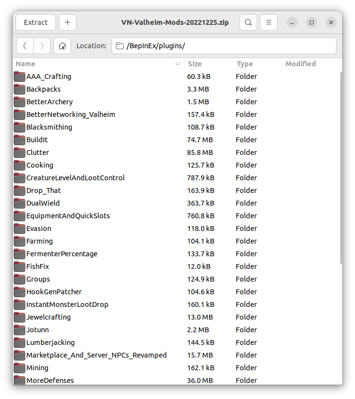

# Valheim Mod Manager

## Overview

This is a script to assist with packaging mods from Thunderstore.io into a zip file for users on private servers so they don't have to hunt down mods themselves.  It will also manage mods for your local game instance for testing prior to deployment.




<video width="1280" height="720" controls=true autoplay=true muted=true>
  <source src="Valheim-mod-manager-demo.webm" type="video/webm">
</video> 

[Valheim mod manager demo video](Valheim-mod-manager-demo.webm)

## Requirements

`pip3 install packaging`

Python3 and the packaging pip.  Tested on Ubuntu 22.04.

## Configuration

Copy `config.yml.DEFAULT` to `config.yml` and adjust as necessary.

### debug

Set the debug flag to `true` for debug output

### gamedir

Set to the location of your local Valheim install

### exportprefix

Set to the filename to export, useful for prepending your server name or something meaningful.

### exportdir

Directory to export bundled mods and change information, feel free to set to a directory managed by Nextcloud for auto-deployment for your users!

### updatedays

Set the number of days for "updated" packages, setting this to '14' will export any plugin updated in the last 14 days in the "updated" package export


## Using

Run `./cli.py` to run the interactive script.

```bash
Valheim Mod Manager

1: List Mods Installed
2: Install New Mod
3: Check For Updates
4: Uninstall Mod
5: Revert Modifications
6: Export/Package Mods
Q: Quit Application

Enter 1-6:
```

The general workflow for using this script: run the script to load your current game mods into the manager.  You may need to select which author the mod should use (some mods are published by different authors but have the same name).

Once loaded, you can update your local mods via `Check For Updates` and install new mods via `Install New Mod`.  Mods can be searched for by mod name or thunderstore URL.  When installing new mods, you will have the option to specify which version to install (defaults to the latest version).  Dependencies are handled automatically.

Mod removal is performed via `Uninstall Mod`, though note it is important to inform users of which mods are removed as they will need to manually remove those mods upon updating.  (ZIP files don't support a "delete this directory" option sadly.)

Your local game client is automatically updated when mods are installed, removed, or updated.  This allows you to test a mod prior to deployment.  **(Note, this is important!  Some mods will break your game/character!)**  For misbehaving mods, they can be reverted via `Revert Modifications`.  This will roll back a mod to its original deployed status (either removed altogether or reset back to a specific version).

Lastly, `Export/Package Mods` will create a variety of files for your users.  A full export will contain all mods and BepInEx, an update zip which contains only mods updated in the last (by default) 14 days, a CHANGELOG which can be published containing all changes, and a MODS file which contains all currently installed mods and their versions.


## Server Mods

For mods that are tagged with the `Server-side` flag, they are also copied into `.cache/server` for manual deployment to your private server.  Simply copy these files to your game server when ready.


## Technical Notes

This application makes heavy use of file caching.  The full packages list from thunderstore.io is only downloaded once a day and mod packages are stored in `.cache/packages` so repeated installs of the same package do not need to download from the site again.